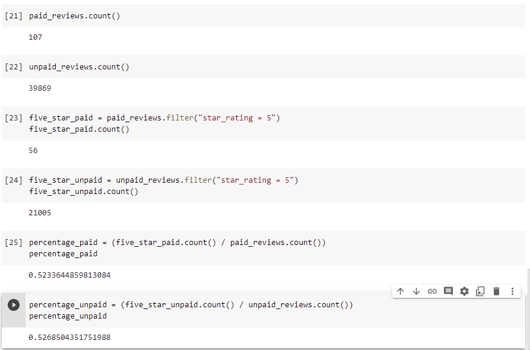

# Amazon_Vine_Analysis

## Overview
- Our mission is determine if there is any bias toward favorable reviews from Vine members in the chosen Amazon Reviews Outdoors dataset. The Amazon Vine program is a service that allows manufacturers and publishers to receive reviews for their products. Companies like SellBy pay a small fee to Amazon and provide products to Amazon Vine members, who are then required to publish a review.

- This summary of the analysis was written for Jennifer, an account manager at BigMarket, to submit to our clientele, the SellBy stakeholders.

## Resources
- Google's Colab Notebooks
- Spark using PySpark and Dplyr libraries
- RDS Database and S3 Bucket Creation in AWS
- PgAdmin with PostgreSQL 

## Results
(Results: Using bulleted lists and images of DataFrames as support, address the following questions:)

- How many Vine reviews and non-Vine reviews were there?
    - There were 107 Vine reviews in the Outdoors dataset.
    - There were 39,869 non-Vine reviews in the Outdoors dataset.

- How many Vine reviews were 5 stars? How many non-Vine reviews were 5 stars?
    - There were 56 five-star Vine reviews in the Outdoors dataset.
    - There were 21,005 five-star non-Vine reviews in the Outdoors dataset.

- What percentage of Vine reviews were 5 stars? What percentage of non-Vine reviews were 5 stars?
    - 52.34% of Vine reviews were 5 stars, while 52.69% of non-Vine reviews were five-stars.

## Summary

- There is little to no positivity bias for the reviews in this set of the Vine reviews. Their was less than a one percent difference between the number of paid five star reviews and unpaid five star reviews.
- An R Coding analysis would provide a much more in depth analysis across the Vine program as a whole. Almost any statistical test could be run with the types of data in these datasets. My suggestion would be Multiple Linear Regression and/or Paired T-Tests.

